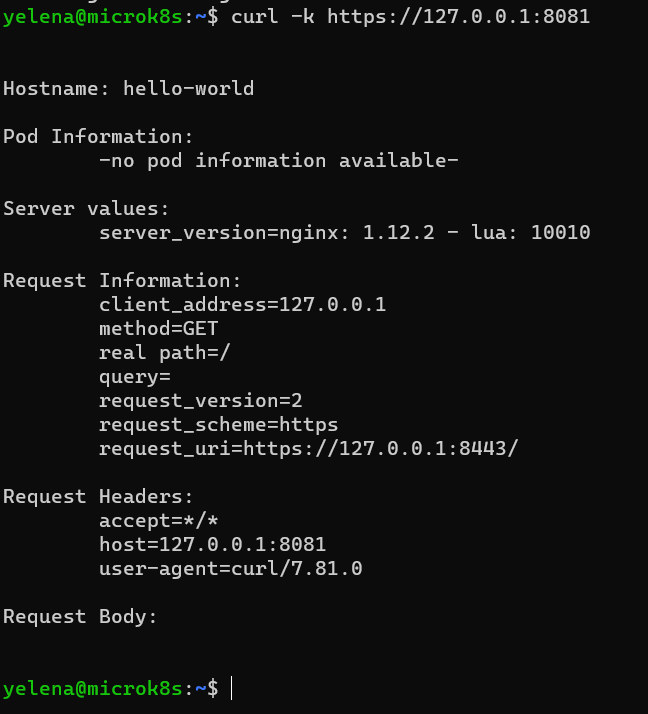
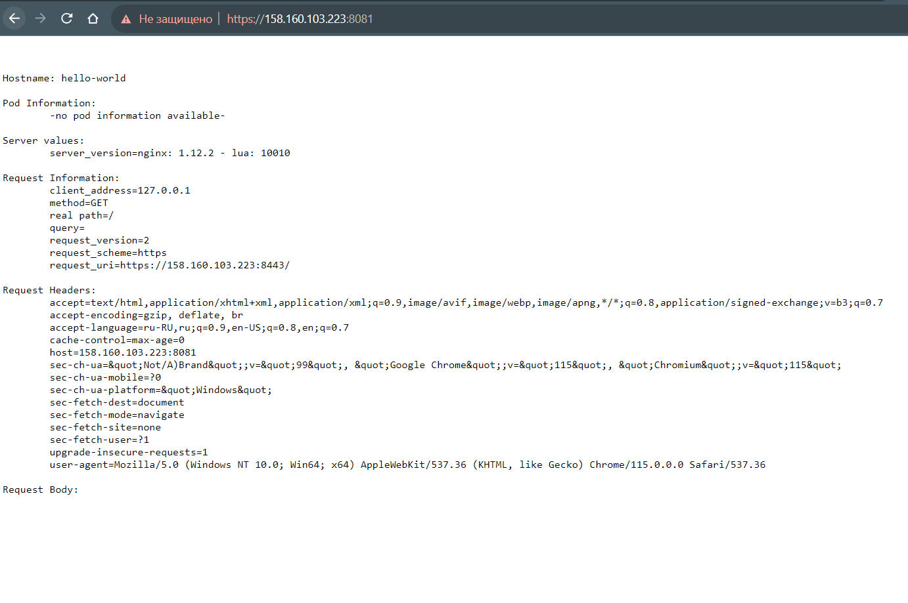
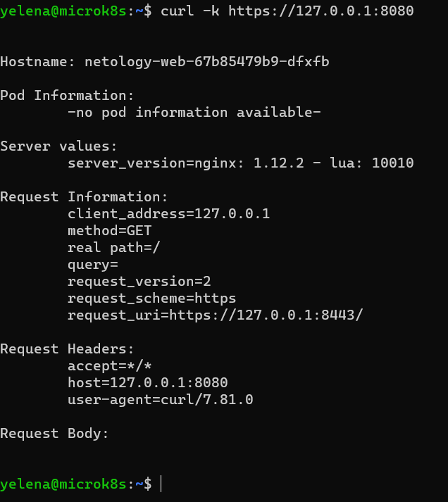
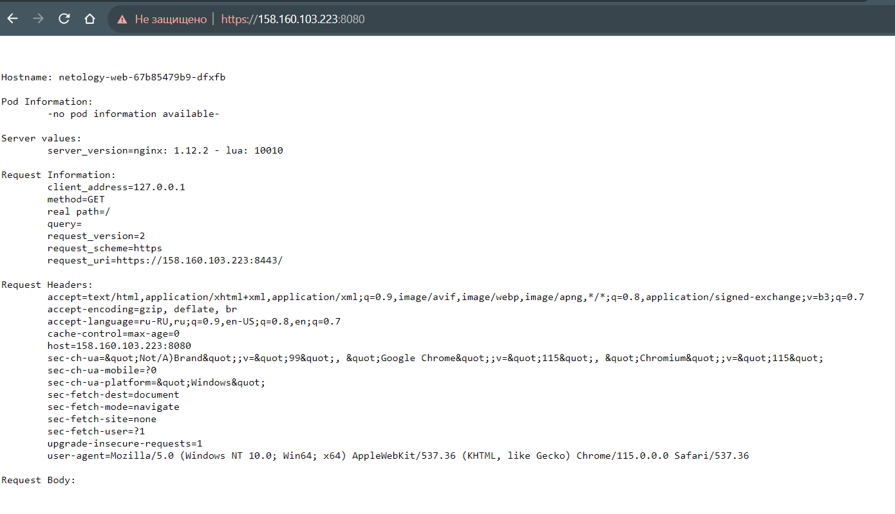

# Домашнее задание к занятию «Базовые объекты K8S»

### Цель задания

В тестовой среде для работы с Kubernetes, установленной в предыдущем ДЗ, необходимо развернуть Pod с приложением и подключиться к нему со своего локального компьютера. 

------

### Чеклист готовности к домашнему заданию

1. Установленное k8s-решение (например, MicroK8S).
2. Установленный локальный kubectl.
3. Редактор YAML-файлов с подключенным Git-репозиторием.

------

### Инструменты и дополнительные материалы, которые пригодятся для выполнения задания

1. Описание [Pod](https://kubernetes.io/docs/concepts/workloads/pods/) и примеры манифестов.
2. Описание [Service](https://kubernetes.io/docs/concepts/services-networking/service/).

------

### Задание 1. Создать Pod с именем hello-world

1. Создать манифест (yaml-конфигурацию) Pod.
2. Использовать image - gcr.io/kubernetes-e2e-test-images/echoserver:2.2.
3. Подключиться локально к Pod с помощью `kubectl port-forward` и вывести значение (curl или в браузере).

### Ответ:
[mypod.yaml](./mypod.yaml)<br />
Идем в под и смотрим что в нем есть:
```
yelena@microk8s:~/.kube$ kubectl exec -ti netology-web-865649bf65-h7b9s -- sh
/ # pwd
/
/ # ls
README.md  certs      etc        lib        mnt        root       sbin       sys        usr
bin        dev        home       media      proc       run        srv        tmp        var
/ #  lsof -i -P -n | grep LISTEN
/ # cat
README.md  certs/     etc/       lib/       mnt/       root/      sbin/      sys/       usr/
bin/       dev/       home/      media/     proc/      run/       srv/       tmp/       var/
/ # cat README.md
# Echoserver

This is a simple server that responds with the http headers it received.

Image Versions >= 1.10 support HTTP2 on :8443.
Image Versions >= 1.9 expose HTTPS endpoint on :8443.
Image versions >= 1.4 removes the redirect introduced in 1.3.
Image versions >= 1.3 redirect requests on :80 with `X-Forwarded-Proto: http` to :443.
Image versions > 1.0 run an nginx server, and implement the echoserver using lua in the nginx config.
Image versions <= 1.0 run a python http server instead of nginx, and don't redirect any requests.
/ # exit
```
Пробрасываем порт, указанный в README пода:
```
yelena@microk8s:~$ microk8s kubectl port-forward pod/hello-world 8081:8443 --address=0.0.0.0
Forwarding from 0.0.0.0:8081 -> 8443
```
Запрос к поду из машины с microk8s:<br />
<br />
Запрос к поду снаружи из браузера:<br />
<br />

------

### Задание 2. Создать Service и подключить его к Pod

1. Создать Pod с именем netology-web.
2. Использовать image — gcr.io/kubernetes-e2e-test-images/echoserver:2.2.
3. Создать Service с именем netology-svc и подключить к netology-web.
4. Подключиться локально к Service с помощью `kubectl port-forward` и вывести значение (curl или в браузере).

### Ответ:
[netology-web.yaml](./netology-web.yaml) + [netology-svc.yaml](./netology-svc.yaml)<br />
Пробрасываем порт, указанный в README пода:
```
yelena@microk8s:~/.kube$ sudo microk8s kubectl port-forward service/netology-svc 8080:8443 --address=0.0.0.0
Forwarding from 0.0.0.0:8080 -> 8443
```
Запрос к поду из машины с microk8s:<br />
<br />
Запрос к поду снаружи из браузера:<br />
<br />

------

### Правила приёма работы

1. Домашняя работа оформляется в своем Git-репозитории в файле README.md. Выполненное домашнее задание пришлите ссылкой на .md-файл в вашем репозитории.
2. Файл README.md должен содержать скриншоты вывода команд `kubectl get pods`, а также скриншот результата подключения.
3. Репозиторий должен содержать файлы манифестов и ссылки на них в файле README.md.

------

### Критерии оценки
Зачёт — выполнены все задания, ответы даны в развернутой форме, приложены соответствующие скриншоты и файлы проекта, в выполненных заданиях нет противоречий и нарушения логики.

На доработку — задание выполнено частично или не выполнено, в логике выполнения заданий есть противоречия, существенные недостатки.
