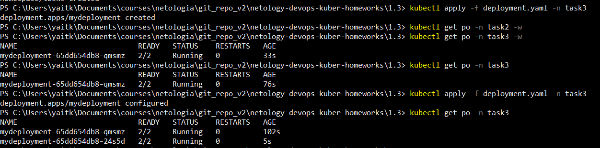
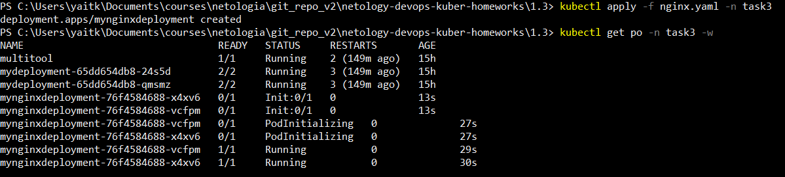
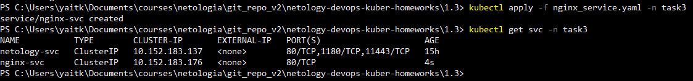

# Домашнее задание к занятию «Запуск приложений в K8S»

### Цель задания

В тестовой среде для работы с Kubernetes, установленной в предыдущем ДЗ, необходимо развернуть Deployment с приложением, состоящим из нескольких контейнеров, и масштабировать его.

------

### Чеклист готовности к домашнему заданию

1. Установленное k8s-решение (например, MicroK8S).
2. Установленный локальный kubectl.
3. Редактор YAML-файлов с подключённым git-репозиторием.

------

### Инструменты и дополнительные материалы, которые пригодятся для выполнения задания

1. [Описание](https://kubernetes.io/docs/concepts/workloads/controllers/deployment/) Deployment и примеры манифестов.
2. [Описание](https://kubernetes.io/docs/concepts/workloads/pods/init-containers/) Init-контейнеров.
3. [Описание](https://github.com/wbitt/Network-MultiTool) Multitool.

------

### Задание 1. Создать Deployment и обеспечить доступ к репликам приложения из другого Pod

1. Создать Deployment приложения, состоящего из двух контейнеров — nginx и multitool. Решить возникшую ошибку.
2. После запуска увеличить количество реплик работающего приложения до 2.
3. Продемонстрировать количество подов до и после масштабирования.
4. Создать Service, который обеспечит доступ до реплик приложений из п.1.
5. Создать отдельный Pod с приложением multitool и убедиться с помощью `curl`, что из пода есть доступ до приложений из п.1.

### Ответ:
[deployment.yaml](./deployment.yaml) + [service.yaml](./service.yaml) + [single_multitool.yaml](./single_multitool.yaml) <br />
Продемонстрировать количество подов до и после масштабирования: <br />
<br />

Создать отдельный Pod с приложением multitool и убедиться с помощью `curl`, что из пода есть доступ до приложений из 
п.1:<br />

<detailes><summary>Проверка доступности</summary>

```
PS C:\Users\yaitk\Documents\courses\netologia\git_repo_v2\netology-devops-kuber-homeworks\1.3> kubectl apply -f single_multitool.yaml -n task3
pod/multitool created
PS C:\Users\yaitk\Documents\courses\netologia\git_repo_v2\netology-devops-kuber-homeworks\1.3> kubectl get po -n task3
NAME                            READY   STATUS    RESTARTS   AGE
mydeployment-65dd654db8-qmsmz   2/2     Running   0          16m
mydeployment-65dd654db8-24s5d   2/2     Running   0          14m
multitool                       1/1     Running   0          9s
PS C:\Users\yaitk\Documents\courses\netologia\git_repo_v2\netology-devops-kuber-homeworks\1.3> kubectl get svc -n task3
NAME           TYPE        CLUSTER-IP       EXTERNAL-IP   PORT(S)                     AGE
netology-svc   ClusterIP   10.152.183.137   <none>        80/TCP,1180/TCP,11443/TCP   7m33s
PS C:\Users\yaitk\Documents\courses\netologia\git_repo_v2\netology-devops-kuber-homeworks\1.3> kubectl exec -ti multitool -n task3 -- sh
/ # curl 10.152.183.137:80
<!DOCTYPE html>
<html>
<head>
<title>Welcome to nginx!</title>
<style>
html { color-scheme: light dark; }
body { width: 35em; margin: 0 auto;
font-family: Tahoma, Verdana, Arial, sans-serif; }
</style>
</head>
<body>
<h1>Welcome to nginx!</h1>
<p>If you see this page, the nginx web server is successfully installed and
working. Further configuration is required.</p>

<p>For online documentation and support please refer to
<a href="http://nginx.org/">nginx.org</a>.<br/>
Commercial support is available at
<a href="http://nginx.com/">nginx.com</a>.</p>

<p><em>Thank you for using nginx.</em></p>
</body>
</html>
/ # curl 10.152.183.137:1180
Praqma Network MultiTool (with NGINX) - mydeployment-65dd654db8-qmsmz - 10.1.128.223 - HTTP: 1180 , HTTPS: 11443
<br>
<hr>
<br>

<h1>05 Jan 2022 - Press-release: `Praqma/Network-Multitool` is now `wbitt/Network-Multitool`</h1>

<h2>Important note about name/org change:</h2>
<p>
Few years ago, I created this tool with Henrik Høegh, as `praqma/network-multitool`. Praqma was bought by another company, and now the "Praqma" brand is being dismantled. This means the network-multitool's git and docker repositories must go. Since, I was the one maintaining the docker image for all these years, it was decided by the current representatives of the company to hand it over to me so I can continue maintaining it. So, apart from a small change in the repository name, nothing has changed.<br>
</p>
<p>
The existing/old/previous container image `praqma/network-multitool` will continue to work and will remain available for **"some time"** - may be for a couple of months - not sure though.
</p>
<p>
- Kamran Azeem <kamranazeem@gmail.com> <a href=https://github.com/KamranAzeem>https://github.com/KamranAzeem</a>
</p>

<h2>Some important URLs:</h2>

<ul>
  <li>The new official github repository for this tool is: <a href=https://github.com/wbitt/Network-MultiTool>https://github.com/wbitt/Network-MultiTool</a></li>

  <li>The docker repository to pull this image is now: <a href=https://hub.docker.com/r/wbitt/network-multitool>https://hub.docker.com/r/wbitt/network-multitool</a></li>
</ul>

<br>
Or:
<br>

<pre>
  <code>
  docker pull wbitt/network-multitool
  </code>
</pre>


<hr>

/ # curl 10.152.183.137:11443
<html>
<head><title>400 The plain HTTP request was sent to HTTPS port</title></head>
<body>
<center><h1>400 Bad Request</h1></center>
<center>The plain HTTP request was sent to HTTPS port</center>
<hr><center>nginx/1.18.0</center>
</body>
</html>
/ # curl 10.152.183.137:11443 -k
<html>
<head><title>400 The plain HTTP request was sent to HTTPS port</title></head>
<body>
<center><h1>400 Bad Request</h1></center>
<center>The plain HTTP request was sent to HTTPS port</center>
<hr><center>nginx/1.18.0</center>
</body>
</html>
/ #
```

</detailes>

------

### Задание 2. Создать Deployment и обеспечить старт основного контейнера при выполнении условий

1. Создать Deployment приложения nginx и обеспечить старт контейнера только после того, как будет запущен сервис этого приложения.
2. Убедиться, что nginx не стартует. В качестве Init-контейнера взять busybox.
3. Создать и запустить Service. Убедиться, что Init запустился.
4. Продемонстрировать состояние пода до и после запуска сервиса.

### Ответ:
[nginx.yaml](./nginx.yaml) + [nginx_service.yaml](./nginx_service.yaml) <br />
Запуск подов с nginx: <br />
<br />

Запуск сервиса nginx: <br />
<br />

------

### Правила приема работы

1. Домашняя работа оформляется в своем Git-репозитории в файле README.md. Выполненное домашнее задание пришлите ссылкой на .md-файл в вашем репозитории.
2. Файл README.md должен содержать скриншоты вывода необходимых команд `kubectl` и скриншоты результатов.
3. Репозиторий должен содержать файлы манифестов и ссылки на них в файле README.md.

------
