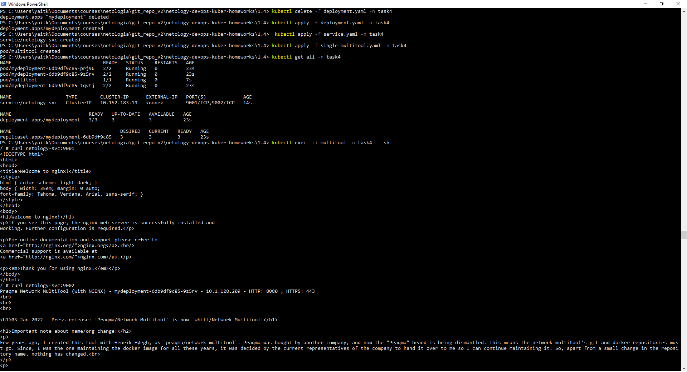
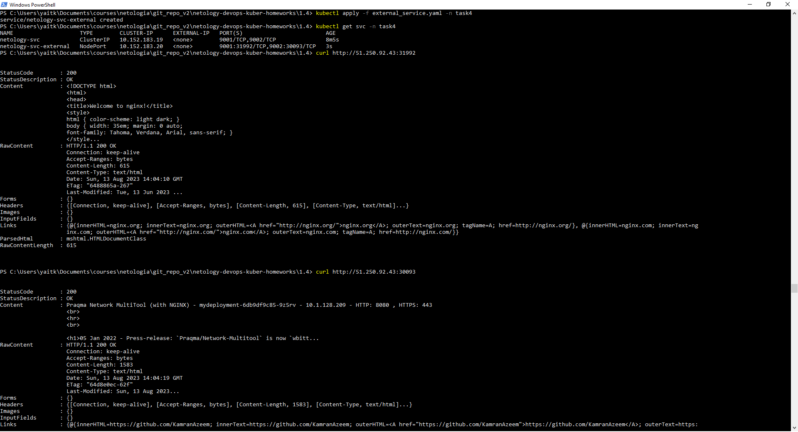

# Домашнее задание к занятию «Сетевое взаимодействие в K8S. Часть 1»

### Цель задания

В тестовой среде Kubernetes необходимо обеспечить доступ к приложению, установленному в предыдущем ДЗ и состоящему из двух контейнеров, по разным портам в разные контейнеры как внутри кластера, так и снаружи.

------

### Чеклист готовности к домашнему заданию

1. Установленное k8s-решение (например, MicroK8S).
2. Установленный локальный kubectl.
3. Редактор YAML-файлов с подключённым Git-репозиторием.

------

### Инструменты и дополнительные материалы, которые пригодятся для выполнения задания

1. [Описание](https://kubernetes.io/docs/concepts/workloads/controllers/deployment/) Deployment и примеры манифестов.
2. [Описание](https://kubernetes.io/docs/concepts/services-networking/service/) Описание Service.
3. [Описание](https://github.com/wbitt/Network-MultiTool) Multitool.

------

### Задание 1. Создать Deployment и обеспечить доступ к контейнерам приложения по разным портам из другого Pod внутри кластера

1. Создать Deployment приложения, состоящего из двух контейнеров (nginx и multitool), с количеством реплик 3 шт.
2. Создать Service, который обеспечит доступ внутри кластера до контейнеров приложения из п.1 по порту 9001 — nginx 80, по 9002 — multitool 8080.
3. Создать отдельный Pod с приложением multitool и убедиться с помощью `curl`, что из пода есть доступ до приложения из п.1 по разным портам в разные контейнеры.
4. Продемонстрировать доступ с помощью `curl` по доменному имени сервиса.
5. Предоставить манифесты Deployment и Service в решении, а также скриншоты или вывод команды п.4.

### Ответ

[deployment.yaml](./deployment.yaml) + [service.yaml](./service.yaml) + [single_multitool.yaml](./single_multitool.yaml) <br /> 
Скриншот команд: <br />
<br />

<details><summary>Весь вывод текстом</summary>

```
PS C:\Users\yaitk\Documents\courses\netologia\git_repo_v2\netology-devops-kuber-homeworks\1.4> kubectl delete -f deployment.yaml -n task4
deployment.apps "mydeployment" deleted
PS C:\Users\yaitk\Documents\courses\netologia\git_repo_v2\netology-devops-kuber-homeworks\1.4> kubectl apply -f deployment.yaml -n task4
deployment.apps/mydeployment created
PS C:\Users\yaitk\Documents\courses\netologia\git_repo_v2\netology-devops-kuber-homeworks\1.4>  kubectl apply -f service.yaml -n task4
service/netology-svc created
PS C:\Users\yaitk\Documents\courses\netologia\git_repo_v2\netology-devops-kuber-homeworks\1.4> kubectl apply -f single_multitool.yaml -n task4
pod/multitool created
PS C:\Users\yaitk\Documents\courses\netologia\git_repo_v2\netology-devops-kuber-homeworks\1.4> kubectl get all -n task4
NAME                                READY   STATUS    RESTARTS   AGE
pod/mydeployment-6db9df9c85-prj96   2/2     Running   0          23s
pod/mydeployment-6db9df9c85-9z5rv   2/2     Running   0          23s
pod/multitool                       1/1     Running   0          7s
pod/mydeployment-6db9df9c85-tqvtj   2/2     Running   0          23s

NAME                   TYPE        CLUSTER-IP      EXTERNAL-IP   PORT(S)             AGE
service/netology-svc   ClusterIP   10.152.183.19   <none>        9001/TCP,9002/TCP   14s

NAME                           READY   UP-TO-DATE   AVAILABLE   AGE
deployment.apps/mydeployment   3/3     3            3           23s

NAME                                      DESIRED   CURRENT   READY   AGE
replicaset.apps/mydeployment-6db9df9c85   3         3         3       23s
PS C:\Users\yaitk\Documents\courses\netologia\git_repo_v2\netology-devops-kuber-homeworks\1.4> kubectl exec -ti multitool -n task4 -- sh
/ # curl netology-svc:9001
<!DOCTYPE html>
<html>
<head>
<title>Welcome to nginx!</title>
<style>
html { color-scheme: light dark; }
body { width: 35em; margin: 0 auto;
font-family: Tahoma, Verdana, Arial, sans-serif; }
</style>
</head>
<body>
<h1>Welcome to nginx!</h1>
<p>If you see this page, the nginx web server is successfully installed and
working. Further configuration is required.</p>

<p>For online documentation and support please refer to
<a href="http://nginx.org/">nginx.org</a>.<br/>
Commercial support is available at
<a href="http://nginx.com/">nginx.com</a>.</p>

<p><em>Thank you for using nginx.</em></p>
</body>
</html>
/ # curl netology-svc:9002
Praqma Network MultiTool (with NGINX) - mydeployment-6db9df9c85-9z5rv - 10.1.128.209 - HTTP: 8080 , HTTPS: 443
<br>
<hr>
<br>

<h1>05 Jan 2022 - Press-release: `Praqma/Network-Multitool` is now `wbitt/Network-Multitool`</h1>

<h2>Important note about name/org change:</h2>
<p>
Few years ago, I created this tool with Henrik Høegh, as `praqma/network-multitool`. Praqma was bought by another company, and now the "Praqma" brand is being dismantled. This means the network-multitool's git and docker repositories must go. Since, I was the one maintaining the docker image for all these years, it was decided by the current representatives of the company to hand it over to me so I can continue maintaining it. So, apart from a small change in the repository name, nothing has changed.<br>
</p>
<p>
The existing/old/previous container image `praqma/network-multitool` will continue to work and will remain available for **"some time"** - may be for a couple of months - not sure though.
</p>
<p>
- Kamran Azeem <kamranazeem@gmail.com> <a href=https://github.com/KamranAzeem>https://github.com/KamranAzeem</a>
</p>

<h2>Some important URLs:</h2>

<ul>
  <li>The new official github repository for this tool is: <a href=https://github.com/wbitt/Network-MultiTool>https://github.com/wbitt/Network-MultiTool</a></li>

  <li>The docker repository to pull this image is now: <a href=https://hub.docker.com/r/wbitt/network-multitool>https://hub.docker.com/r/wbitt/network-multitool</a></li>
</ul>

<br>
Or:
<br>

<pre>
  <code>
  docker pull wbitt/network-multitool
  </code>
</pre>


<hr>

/ #
```

</details>
------

### Задание 2. Создать Service и обеспечить доступ к приложениям снаружи кластера

1. Создать отдельный Service приложения из Задания 1 с возможностью доступа снаружи кластера к nginx, используя тип NodePort.
2. Продемонстрировать доступ с помощью браузера или `curl` с локального компьютера.
3. Предоставить манифест и Service в решении, а также скриншоты или вывод команды п.2.

### Ответ

[external_service.yaml](./external_service.yaml)<br />
Скриншот команд: <br />
<br />

<details><summary>Весь вывод текстом</summary>

```
PS C:\Users\yaitk\Documents\courses\netologia\git_repo_v2\netology-devops-kuber-homeworks\1.4> kubectl apply -f external_service.yaml -n task4
service/netology-svc-external created
PS C:\Users\yaitk\Documents\courses\netologia\git_repo_v2\netology-devops-kuber-homeworks\1.4> kubectl get svc -n task4
NAME                    TYPE        CLUSTER-IP      EXTERNAL-IP   PORT(S)                         AGE
netology-svc            ClusterIP   10.152.183.19   <none>        9001/TCP,9002/TCP               8m5s
netology-svc-external   NodePort    10.152.183.20   <none>        9001:31992/TCP,9002:30093/TCP   3s
PS C:\Users\yaitk\Documents\courses\netologia\git_repo_v2\netology-devops-kuber-homeworks\1.4> curl http://51.250.92.43:31992


StatusCode        : 200
StatusDescription : OK
Content           : <!DOCTYPE html>
                    <html>
                    <head>
                    <title>Welcome to nginx!</title>
                    <style>
                    html { color-scheme: light dark; }
                    body { width: 35em; margin: 0 auto;
                    font-family: Tahoma, Verdana, Arial, sans-serif; }
                    </style...
RawContent        : HTTP/1.1 200 OK
                    Connection: keep-alive
                    Accept-Ranges: bytes
                    Content-Length: 615
                    Content-Type: text/html
                    Date: Sun, 13 Aug 2023 14:04:10 GMT
                    ETag: "6488865a-267"
                    Last-Modified: Tue, 13 Jun 2023 ...
Forms             : {}
Headers           : {[Connection, keep-alive], [Accept-Ranges, bytes], [Content-Length, 615], [Content-Type, text/html]...}
Images            : {}
InputFields       : {}
Links             : {@{innerHTML=nginx.org; innerText=nginx.org; outerHTML=<A href="http://nginx.org/">nginx.org</A>; outerText=nginx.org; tagName=A; href=http://nginx.org/}, @{innerHTML=nginx.com; innerText=ng
                    inx.com; outerHTML=<A href="http://nginx.com/">nginx.com</A>; outerText=nginx.com; tagName=A; href=http://nginx.com/}}
ParsedHtml        : mshtml.HTMLDocumentClass
RawContentLength  : 615


PS C:\Users\yaitk\Documents\courses\netologia\git_repo_v2\netology-devops-kuber-homeworks\1.4> curl http://51.250.92.43:30093


StatusCode        : 200
StatusDescription : OK
Content           : Praqma Network MultiTool (with NGINX) - mydeployment-6db9df9c85-9z5rv - 10.1.128.209 - HTTP: 8080 , HTTPS: 443
                    <br>
                    <hr>
                    <br>

                    <h1>05 Jan 2022 - Press-release: `Praqma/Network-Multitool` is now `wbitt...
RawContent        : HTTP/1.1 200 OK
                    Connection: keep-alive
                    Accept-Ranges: bytes
                    Content-Length: 1583
                    Content-Type: text/html
                    Date: Sun, 13 Aug 2023 14:04:19 GMT
                    ETag: "64d8e0ec-62f"
                    Last-Modified: Sun, 13 Aug 2023...
Forms             : {}
Headers           : {[Connection, keep-alive], [Accept-Ranges, bytes], [Content-Length, 1583], [Content-Type, text/html]...}
Images            : {}
InputFields       : {}
Links             : {@{innerHTML=https://github.com/KamranAzeem; innerText=https://github.com/KamranAzeem; outerHTML=<A href="https://github.com/KamranAzeem">https://github.com/KamranAzeem</A>; outerText=https:
                    //github.com/KamranAzeem; tagName=A; href=https://github.com/KamranAzeem}, @{innerHTML=https://github.com/wbitt/Network-MultiTool; innerText=https://github.com/wbitt/Network-MultiTool; outer
                    HTML=<A href="https://github.com/wbitt/Network-MultiTool">https://github.com/wbitt/Network-MultiTool</A>; outerText=https://github.com/wbitt/Network-MultiTool; tagName=A; href=https://github
                    .com/wbitt/Network-MultiTool}, @{innerHTML=https://hub.docker.com/r/wbitt/network-multitool; innerText=https://hub.docker.com/r/wbitt/network-multitool; outerHTML=<A href="https://hub.docker
                    .com/r/wbitt/network-multitool">https://hub.docker.com/r/wbitt/network-multitool</A>; outerText=https://hub.docker.com/r/wbitt/network-multitool; tagName=A; href=https://hub.docker.com/r/wbi
                    tt/network-multitool}}
ParsedHtml        : mshtml.HTMLDocumentClass
RawContentLength  : 1583


PS C:\Users\yaitk\Documents\courses\netologia\git_repo_v2\netology-devops-kuber-homeworks\1.4>
```

</details>

------

### Правила приёма работы

1. Домашняя работа оформляется в своем Git-репозитории в файле README.md. Выполненное домашнее задание пришлите ссылкой на .md-файл в вашем репозитории.
2. Файл README.md должен содержать скриншоты вывода необходимых команд `kubectl` и скриншоты результатов.
3. Репозиторий должен содержать тексты манифестов или ссылки на них в файле README.md.

