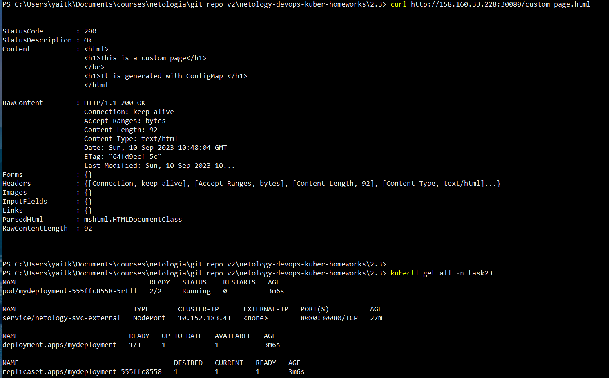
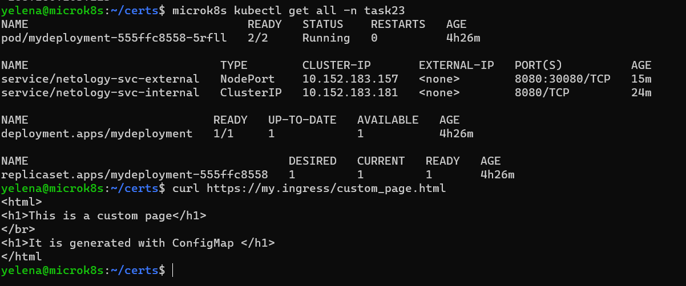

# Домашнее задание к занятию «Конфигурация приложений»

### Цель задания

В тестовой среде Kubernetes необходимо создать конфигурацию и продемонстрировать работу приложения.

------

### Чеклист готовности к домашнему заданию

1. Установленное K8s-решение (например, MicroK8s).
2. Установленный локальный kubectl.
3. Редактор YAML-файлов с подключённым GitHub-репозиторием.

------

### Инструменты и дополнительные материалы, которые пригодятся для выполнения задания

1. [Описание](https://kubernetes.io/docs/concepts/configuration/secret/) Secret.
2. [Описание](https://kubernetes.io/docs/concepts/configuration/configmap/) ConfigMap.
3. [Описание](https://github.com/wbitt/Network-MultiTool) Multitool.

------

### Задание 1. Создать Deployment приложения и решить возникшую проблему с помощью ConfigMap. Добавить веб-страницу

1. Создать Deployment приложения, состоящего из контейнеров busybox и multitool.
2. Решить возникшую проблему с помощью ConfigMap.
3. Продемонстрировать, что pod стартовал и оба конейнера работают.
4. Сделать простую веб-страницу и подключить её к Nginx с помощью ConfigMap. Подключить Service и показать вывод curl или в браузере.
5. Предоставить манифесты, а также скриншоты или вывод необходимых команд.

### Ответ:
[custom-page.yaml](./custom-page.yaml) + [external_service.yaml](./external_service.yaml) + [deployment.yaml](./deployment.yaml)
```
> kubectl apply -f .\custom-page.yaml
configmap/custom-html-page-configmap configured
> kubectl apply -f .\external_service.yaml
service/netology-svc-external created
> kubectl apply -f .\deployment.yaml
deployment.apps/mydeployment create
```


------

### Задание 2. Создать приложение с вашей веб-страницей, доступной по HTTPS 

1. Создать Deployment приложения, состоящего из Nginx.
2. Создать собственную веб-страницу и подключить её как ConfigMap к приложению.
3. Выпустить самоподписной сертификат SSL. Создать Secret для использования сертификата.
4. Создать Ingress и необходимый Service, подключить к нему SSL в вид. Продемонстировать доступ к приложению по HTTPS. 
4. Предоставить манифесты, а также скриншоты или вывод необходимых команд.

### Ответ
Делаем серты и добавляем публичный в доверенные:
```
openssl req -x509 -nodes -days 9999 -newkey rsa:2048 -keyout ingress-tls.key -out ingress-tls.crt
sudo cp ingress-tls.crt /usr/local/share/ca-certificates/
sudo update-ca-certificates
```
На хосте с MicroK8s прописываем настройки DNS для разрешения имени ingress: <br />
[/etc/hosts](./microk8s_hosts) + [/etc/resolv.conf](./microk8s_resolv.conf)<br />
Поднимаем Ingress и внутренний сервис: <br />
[ingress.yaml](./ingress.yaml) + [internal_service.yaml](./internal_service.yaml)<br />



------

### Правила приёма работы

1. Домашняя работа оформляется в своём GitHub-репозитории в файле README.md. Выполненное домашнее задание пришлите ссылкой на .md-файл в вашем репозитории.
2. Файл README.md должен содержать скриншоты вывода необходимых команд `kubectl`, а также скриншоты результатов.
3. Репозиторий должен содержать тексты манифестов или ссылки на них в файле README.md.

------
