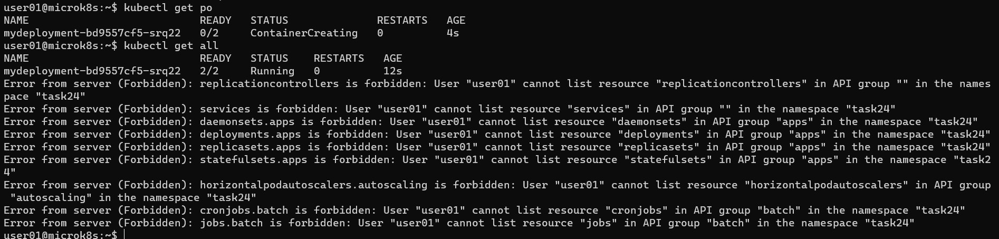
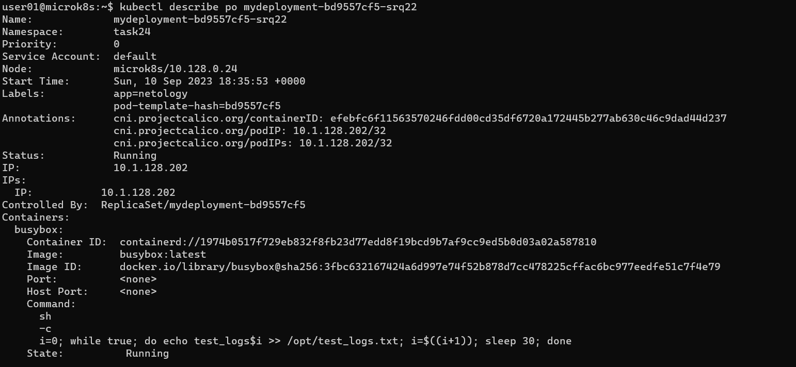

# Домашнее задание к занятию «Управление доступом»

### Цель задания

В тестовой среде Kubernetes нужно предоставить ограниченный доступ пользователю.

------

### Чеклист готовности к домашнему заданию

1. Установлено k8s-решение, например MicroK8S.
2. Установленный локальный kubectl.
3. Редактор YAML-файлов с подключённым github-репозиторием.

------

### Инструменты / дополнительные материалы, которые пригодятся для выполнения задания

1. [Описание](https://kubernetes.io/docs/reference/access-authn-authz/rbac/) RBAC.
2. [Пользователи и авторизация RBAC в Kubernetes](https://habr.com/ru/company/flant/blog/470503/).
3. [RBAC with Kubernetes in Minikube](https://medium.com/@HoussemDellai/rbac-with-kubernetes-in-minikube-4deed658ea7b).

------

### Задание 1. Создайте конфигурацию для подключения пользователя

1. Создайте и подпишите SSL-сертификат для подключения к кластеру.
2. Настройте конфигурационный файл kubectl для подключения.
3. Создайте роли и все необходимые настройки для пользователя.
4. Предусмотрите права пользователя. Пользователь может просматривать логи подов и их конфигурацию (`kubectl logs pod <pod_id>`, `kubectl describe pod <pod_id>`).
5. Предоставьте манифесты и скриншоты и/или вывод необходимых команд.

### Ответ
Включаем RBAC в MicroK8s
```
yelena@microk8s:~$ microk8s enable rbac
Infer repository core for addon rbac
Enabling RBAC
Reconfiguring apiserver
Restarting apiserver
RBAC is enabled
```

Создаем и подписываем сертификат пользователя
```
yelena@microk8s:~$ sudo openssl req -new -key /home/user01/user01.key \
-out /home/user01/user01.csr \
-subj "/CN=user01"

yelena@microk8s:~$ sudo ls -la /home/user01
total 16
drwxr-xr-x 2 user01 user01 4096 Sep 10 16:46 .
drwxr-xr-x 5 root   root   4096 Sep 10 16:45 ..
-rw-r--r-- 1 root   root    887 Sep 10 16:46 user01.csr
-rw------- 1 root   root   1704 Sep 10 16:45 user01.key

yelena@microk8s:/var/snap/microk8s/current/certs$ sudo openssl x509 -req -in /home/user01/user01.csr \
-CA /var/snap/microk8s/current/certs/ca.crt \
-CAkey /var/snap/microk8s/current/certs/ca.key \
-CAcreateserial \
-out /home/user01/user01.crt -days 99999
Certificate request self-signature ok
subject=CN = user01

yelena@microk8s:/var/snap/microk8s/current/certs$ microk8s kubectl config set-credentials user01 \
--client-certificate=/home/user01/.config/user01.crt \
--client-key=/home/user01/.config/user01.key
User "user01" set.

yelena@microk8s:/var/snap/microk8s/current/certs$ microk8s kubectl config set-context user01-context \
--cluster=microk8s-cluster --user=user01 --namespace=task24
Context "user01-context" created.
```
Создадим RoleBinding с помощью команды (с помощью файла не получилось, возможно издержки microk8s)
```
> kubectl create rolebinding user01-role-binding --role pod-logs-desc --user user01 --namespace task24
rolebinding.rbac.authorization.k8s.io/user01-role-binding created
```
[role.yaml](./role.yaml) + [/home/user01/.kube/config](./user01_kube_config) + [deployment.yaml](./deployment.yaml) 
(для тестирования)
<br />
 <br />
 <br />


------

### Правила приёма работы

1. Домашняя работа оформляется в своём Git-репозитории в файле README.md. Выполненное домашнее задание пришлите ссылкой на .md-файл в вашем репозитории.
2. Файл README.md должен содержать скриншоты вывода необходимых команд `kubectl`, скриншоты результатов.
3. Репозиторий должен содержать тексты манифестов или ссылки на них в файле README.md.

------

