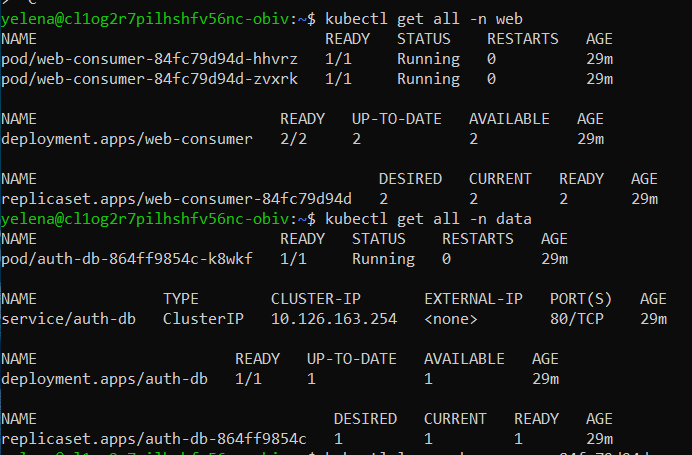
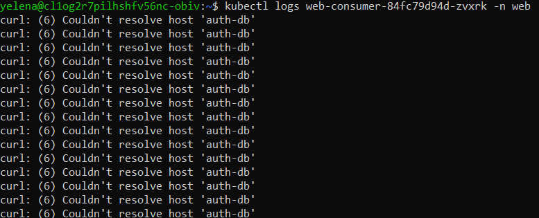
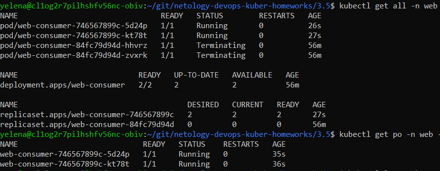
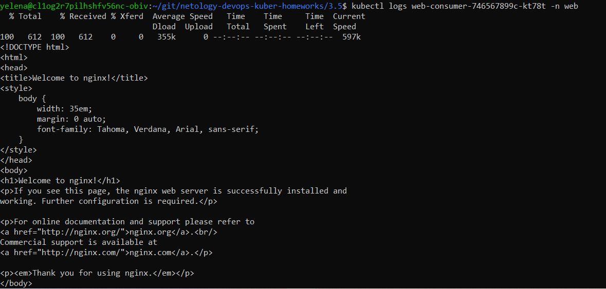

# Домашнее задание к занятию Troubleshooting

### Цель задания

Устранить неисправности при деплое приложения.

### Чеклист готовности к домашнему заданию

1. Кластер K8s.

### Задание. При деплое приложение web-consumer не может подключиться к auth-db. Необходимо это исправить

1. Установить приложение по команде:
```shell
kubectl apply -f https://raw.githubusercontent.com/netology-code/kuber-homeworks/main/3.5/files/task.yaml
```
2. Выявить проблему и описать.
3. Исправить проблему, описать, что сделано.
4. Продемонстрировать, что проблема решена.

### Ответ:
Ставим приложение:
```
yelena@cl1og2r7pilhshfv56nc-obiv:~$ kubectl apply -f https://raw.githubusercontent.com/netology-code/kuber-homeworks/main/3.5/files/task.yaml
Error from server (NotFound): error when creating "https://raw.githubusercontent.com/netology-code/kuber-homeworks/main/3.5/files/task.yaml": namespaces "web" not found
Error from server (NotFound): error when creating "https://raw.githubusercontent.com/netology-code/kuber-homeworks/main/3.5/files/task.yaml": namespaces "data" not found
Error from server (NotFound): error when creating "https://raw.githubusercontent.com/netology-code/kuber-homeworks/main/3.5/files/task.yaml": namespaces "data" not found
```
Создаем namespaces и снова пробуем установить:
```
yelena@cl1og2r7pilhshfv56nc-obiv:~$ kubectl create ns web
namespace/web created
yelena@cl1og2r7pilhshfv56nc-obiv:~$ kubectl create ns data
namespace/data created
yelena@cl1og2r7pilhshfv56nc-obiv:~$ kubectl apply -f https://raw.githubusercontent.com/netology-code/kuber-homeworks/main/3.5/files/task.yaml
deployment.apps/web-consumer created
deployment.apps/auth-db created
service/auth-db created
```
Смотрим, что создалось:

Что в логах у web части:

Выгружаем манифест [web-consumer_deployment.yaml](./web-consumer_deployment.yaml): 
```
mkdir git/netology-devops-kuber-homeworks/3.5 && cd git/netology-devops-kuber-homeworks/3.5 && kubectl get deployment.apps/web-consumer -n web -o yaml >> web-consumer_deployment.yaml
```
В нем идет обращение к db как:
```
...
      - command:
        - sh
        - -c
        - while true; do curl auth-db; sleep 5; done
...        
```
Но web и db находятся в разных namespace, поэтому короткое имя сервиса не резолвится -> использовать полную запись, которая есть в Kubernetes DNS: **auth-db.data.svc.cluster.local**. Т.е. новая команда для выполнения в контейнере web будет выглядеть так:
```
...
      - command:
        - sh
        - -c
        - while true; do curl auth-db.data.svc.cluster.local; sleep 5; done
...        
```
Меняем манифест развертки через команду:
```
$ kubectl edit deployment.apps/web-consumer -n web
deployment.apps/web-consumer edited
```
Ждем, пока пересоздадутся поды:

Смотрим логи:


### Правила приёма работы

1. Домашняя работа оформляется в своём Git-репозитории в файле README.md. Выполненное домашнее задание пришлите ссылкой на .md-файл в вашем репозитории.
2. Файл README.md должен содержать скриншоты вывода необходимых команд, а также скриншоты результатов.
3. Репозиторий должен содержать тексты манифестов или ссылки на них в файле README.md.
